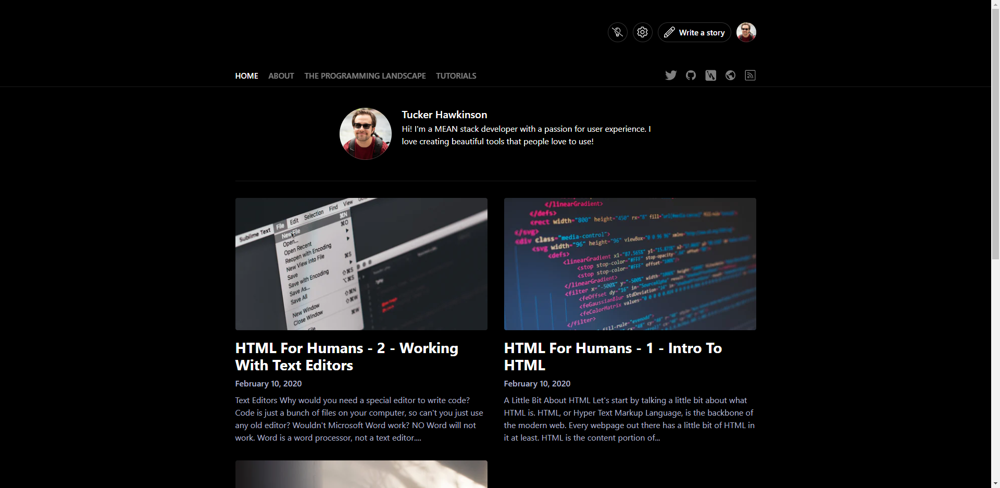

This is my second Post

## this is an h2 heading

### this is an h3 heading

This is a test of some inline code: `console.log('hello')`

[And a link](https://google.com)

And An Image


```js
console.log('hello World!');
console.log('this is amazing');
```

```js
import React from 'react';

const Dump = props => (
  <div
    style={{
      fontSize: 20,
      border: '1px solid #efefef',
      padding: 10,
      background: 'white'
    }}
  >
    {Object.entries(props).map(([key, val]) => (
      <pre key={key}>
        <strong style={{ color: 'white', background: 'red' }}>
          {key}{' '}
          <span role='img' aria-label='poop-emoji'>
            💩
          </span>
        </strong>
        {JSON.stringify(val, '', ' ')}
      </pre>
    ))}
  </div>
);

export default Dump;
```

#### h4 heading

##### h5 heading

###### h6 heading
